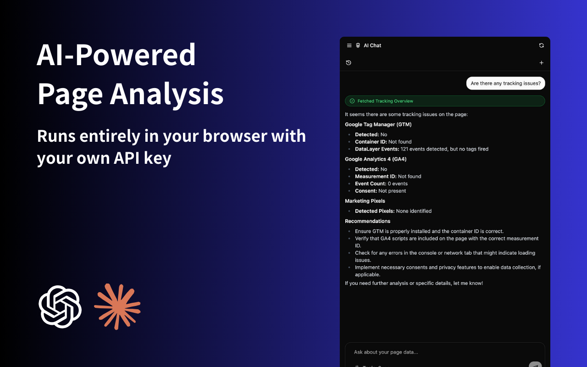
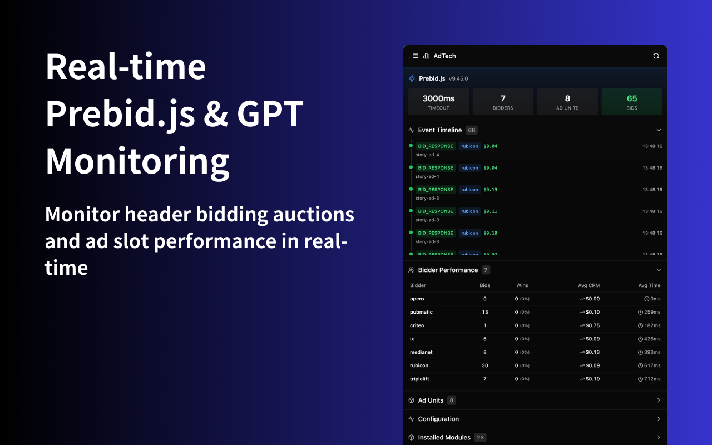
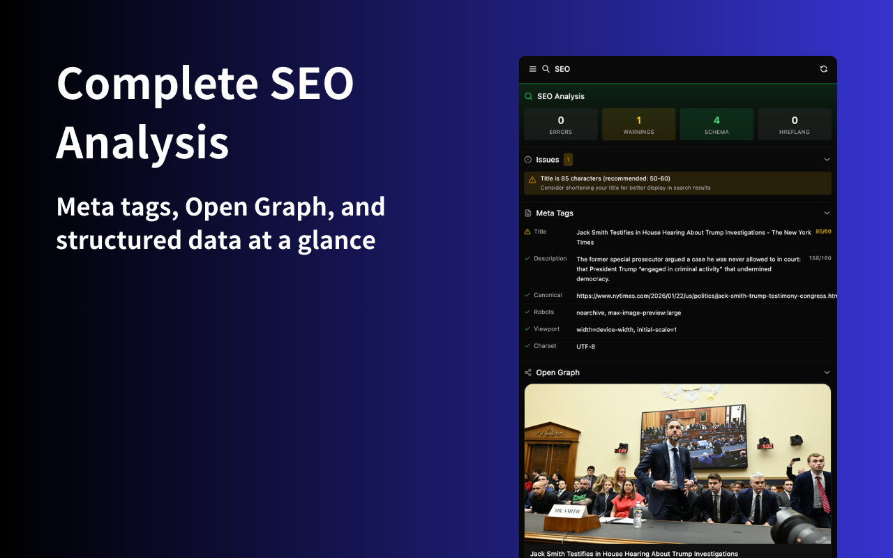

# Web Publisher Debugger

SEO、AdTech（Prebid.js、GPT）、トラッキング（GA4、GTM）のデバッグを支援するChrome拡張機能。AI分析機能付き。

[English README](README.md)

## スクリーンショット





## 機能

### SEO分析
- メタタグとOpen Graphの検証
- 構造化データ（JSON-LD）の確認
- 正規URL（canonical）とrobots設定のチェック
- モバイルビューポートの確認

### AdTechデバッグ
- **Prebid.js**: リアルタイムオークション監視、入札分析、タイムアウト追跡
- **Google Publisher Tag（GPT）**: スロット設定、ターゲティングパラメータ、リフレッシュ検出

### トラッキング分析
- **Google Tag Manager**: コンテナ検出、dataLayerイベント監視
- **Google Analytics 4**: 設定の検証、イベントトラッキング
- **トラッキングピクセル**: Facebook、Twitter、LinkedIn、Pinterestピクセルの検出

### AIアシスタント（ベータ版）
- ページデータについて自然言語で質問
- 自分のClaudeまたはGPT APIキーを使用した100%ローカル処理
- プライバシー重視：APIキーはローカルに保存され、当社サーバーには送信されません

## インストール

### Chrome Web Storeから
近日公開予定

### 手動インストール（開発用）

1. リポジトリをクローン
```bash
git clone https://github.com/noviq-ai/web-publisher-debugger.git
cd web-publisher-debugger
```

2. 依存関係をインストール
```bash
npm install
```

3. 拡張機能をビルド
```bash
npm run build
```

4. Chromeにロード
   - `chrome://extensions/` を開く
   - 「デベロッパーモード」を有効にする
   - 「パッケージ化されていない拡張機能を読み込む」をクリック
   - `dist` フォルダを選択

## 使い方

1. ブラウザのツールバーで拡張機能のアイコンをクリック
2. 分析したいWebページに移動
3. サイドパネルに収集されたデータがカテゴリ別に表示されます：
   - **SEO**: メタタグ、構造化データなど
   - **AdTech**: Prebid.jsとGPTスロット情報
   - **Tracking**: GTM、GA4、ピクセルデータ

4. （オプション）設定でAIアシスタントを構成すると、ページデータについて質問できます

## プライバシー

- すべてのデータは**ブラウザ内でローカル処理**されます
- 外部サーバーへのデータ送信はありません（AI機能使用時のAIプロバイダーを除く）
- APIキーはChromeの暗号化ストレージを使用してローカルに保存されます
- 詳細は[プライバシーポリシー](PRIVACY.md)をご覧ください

## 技術スタック

- React 18 + TypeScript
- Vite
- Tailwind CSS
- shadcn/ui
- Vercel AI SDK
- Chrome Extension Manifest V3

## コントリビューション

コントリビューションを歓迎します！お気軽にPull Requestを送ってください。

## ライセンス

[MITライセンス](LICENSE) - Copyright (c) 2025 Noviq LLC
